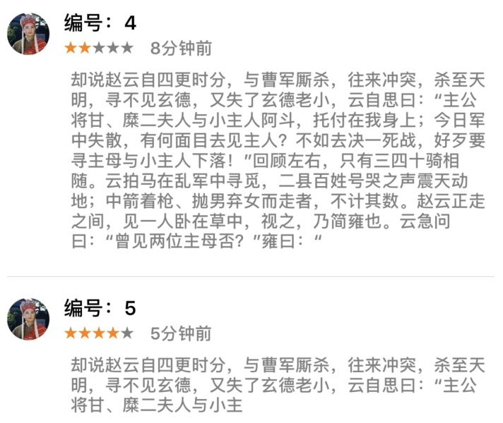
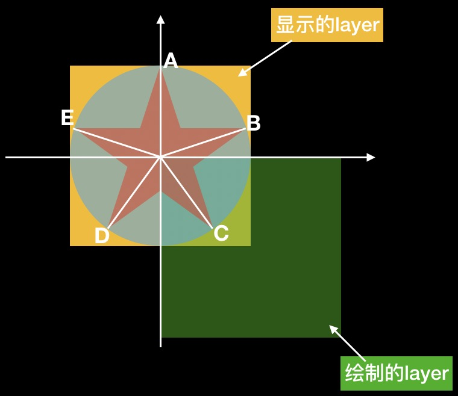
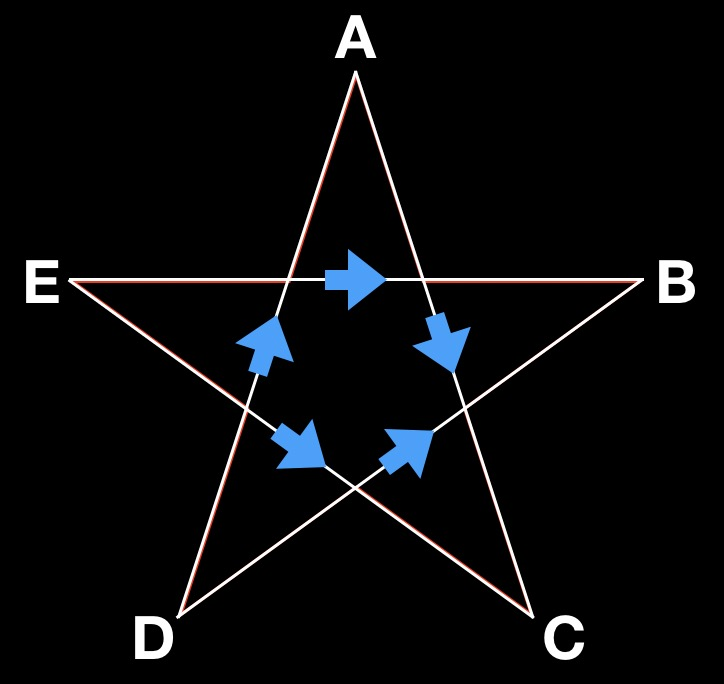

## iOS贝塞尔曲线、ShapeLayer绘制五角星

画五角星做啥？比如评价："★ ★ ★ ★ ★"

你这不是用符号打出来了么？还写它干啥？



思路：
> * 计算五个顶点
> * UIBezierPath连接
> * 绘制到CAShapeLayer上

为了便于计算，以绿色视图左上角为坐标原点计算各个点，最后显示到黄色的视图上（绿色视图origin为黄色视图的中心点），如下图：



#### 计算五个顶点
五角星中心即为外接圆的中心，假定圆的半径为 **r** ，可依次获得顶点 `A` `B` `C` `D` `E` 的坐标：


| 点  | 坐标值  |
|------------- | ------------- |
| A | (0, -r) |
| B | (r\*cos(18), -r\*sin(18)) |
| C | (r\*cos(54), -r\*sin(54)) |
| D | (-r\*sin(36), r\*cos(36) |
| E | (-r\*cos(18), -r\*sin(18)) |


#### UIBezierPath连接
`move` 到起点，`addLine` 连接各个点。连接顺序依次按照 `A->C->E->B->D` **一笔画五角星的顺序** 去连接，`D->A` 闭合可以使用贝塞尔曲线的 `close` 方法（实测也可以不用调用），如下图：


#### 绘制到CAShapeLayer上
创建一个 `shapeLayer`，图二中绿色的绘制layer。

1、 `shapeLayer` 的 `frame` 原点要设置到中心即可，为了便于计算，星星的顶点一部分绘制到外部，这个layer原点放到中心即可保证星星正常显示。

2、`shapeLayer` 的 `fillRule` 要设置为：
OC： `kCAFillRuleNonZero` 、Swift： `.nonZero`


#### layer的复用
这里在绘制的时候存了所有的layer，每次只改变颜色，避免反复创建。

```
if (index > (int)(self.shapeLayers.count) - 1) {
	//如果缺少layer，就创建
}else{
	//取出来更改颜色
}
```

期间还碰到一个问题： 在 `OC` 中用数组长度-1的问题，那就是长度 `count` 是 `NSUInteger` 类型的，-1就……就不是你想要的结果了，在 `Swift` 里是没有问题的。